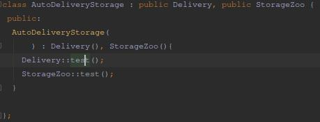
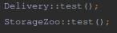
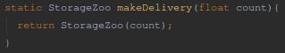

# Зоопарк

### Класс Зоопарк
  * Методи
    1. Показати всіх тварин
    2. Отримати інформацію про всіх тварин
    3. Отримати інформацію про випадкову тварину
    4. Показати усіх працівників зоопарку
  * Властивості
    1. Всі тварини
    2. Тільки літаючі
    3. Тільки ссавці
    4. Всі Працівники

## Класс Тварин (Abstract)
* Властивості
  1. Ім'я
  2. Колір
  3. Голос
  4. Природнє середовище
  5. Кількість лап
  6. Кількість крил
  7. Вміння літати
  7. Вміння плавати
* Методи
  1. відтворити голос
  2. Отримати ім'я
  3. Отримати Колір
  4. Отримати Природнє середовище

### Класс ссавці : тварини
* Методи
  1. Показати інформацію
  1. відтворити голос
  2. Отримати ім'я
  3. Отримати Колір
  4. Отримати Природнє середовище
* Властивості
  1. Ім'я
  2. Колір
  3. Голос
  4. Природнє середовище
  5. Кількість лап
  7. Вміння літати
  7. Вміння плавати

### Класс літаючі : тварини
* Методи
  1. Показати інформацію
  1. відтворити голос
  2. Отримати ім'я
  3. Отримати Колір
  4. Отримати Природнє середовище
* Властивості
  1. Ім'я
  2. Колір
  3. Голос
  4. Природнє середовище
  5. Кількість лап
  7. Вміння літати
  6. Кількість крил

## Класс Людина (Abstract)
* Властивості
 + Структура  
    1. Ім'я
    2. Вік
    3. Стать
    4. Досвід роботи
    5. Посада
* Методи
  1. Отримати ім'я
  2. Отримати Вік
  3. Отримати Стать
  4. Отримати Досвід роботи
  5. Отримати Посаду
  6. Установити Досвід роботи
  7. Установити Посаду
  8. Показати паспорт
## Класс Робітник
* Властивості
  1. Список чоловічих імен
  2. Список жіночих імен
  3. + Структура  
      1. Ім'я
      2. Вік
      3. Стать
      4. Досвід роботи
      5. Посада
  4. Список усіх імен
* Методи
  1. Найняти Робітника (5 штук)

## Класс StorageZoo ##
  * Методи
    1. Показати кількість
    2. Вивід назви

### Описати приклад множинного наслідування між вже існуючими класами або довизначити нові класи для реалізації множинного наслідування ###

### Для одного з класів придумати конструктор копіювання ###

### Привести приклад проблеми повторного наслідування, вирішити її за допомогою визначення віртуального базового класу ###
Звернення через ::

### Статичні члени даних. ### 

